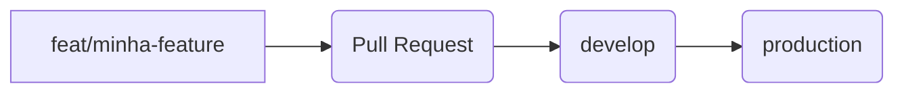

#  porque-o-java-exige

Bem-vindo à organização **porque-o-java-exige**!  
Aqui reunimos projetos acadêmicos e colaborativos que exploram o ecossistema Java e outras tecnologias, sempre com foco em aprendizado, boas práticas e código de qualidade.

---

#  Guia Essencial de Git: Conceitos e Padrões

Este é um resumo dos conceitos e padrões de nomenclatura para **Commit**, **Branch** e **Pull Request (PR)**, visando um histórico de código claro e colaborativo.  

Mais detalhes:  
- [Nomenclatura das Branches](https://github.com/professor-correa/campus-datacenter-explorer/issues/3)  
- [Padrão de Commits, Branches e Pull Request](https://github.com/professor-correa/campus-datacenter-explorer/issues/4)  

---

##  1. Os 3 Pilares do Git

| Conceito | Emoji | Definição |
| :--- | :--- | :--- |
| 🧩 **Commit** | 💾 | **Salva uma mudança** no histórico. Requer mensagem clara e descritiva. |
| 🌿 **Branch** | 🌱 | Uma **linha de desenvolvimento isolada**. Permite trabalhar em recursos sem impactar o código principal (`develop`, `production`). |
| 🔄 **Pull Request** | 🤝 | Uma **solicitação formal para mesclar** mudanças de uma branch para outra. É o ponto de revisão e validação. |

> 🔑 **Por que PRs são vitais?** Garantem revisão colaborativa, previnem erros e documentam decisões.

---

##  2. Fork: O Repositório Pessoal

Quando você não tem permissão de escrita direta no repositório principal, é necessário criar um **Fork**.

- **O que é um Fork?** Uma cópia independente do repositório original para a sua conta.  
- **Propósito:** Permite alterar e testar sem afetar o projeto principal.  
- **Fluxo:** Você forka, trabalha nas suas branches e, ao finalizar, abre um Pull Request do seu Fork para o repositório original.  

###  Regra de Ouro para PRs
>  **Abra o Pull Request somente quando o trabalho estiver concluído e pronto para revisão.**

---

##  3. Padrões de Nomenclatura

A padronização é crucial para automatizar ferramentas e entender o histórico rapidamente.

###  Commits
Formato: `tipo: descrição da mudança`  

| Tipo | Emoji | Significado | Exemplo |
| :--- | :--- | :--- | :--- |
| `feat:` | 🚀 | Nova feature. | `feat: added user profile page` |
| `fix:` | 🧰 | Correção de bug. | `fix: resolved values on header` |
| `docs:` | 📘 | Documentação. | `docs: updated contribution guide` |
| `refactor:` | 🧱 | Refatoração sem nova feature. | `refactor: simplified auth logic` |
| `chore:` | ⚙️ | Mudanças estruturais. | `chore: updated dependencies` |
| `assets:` | 🖼️ | Arquivos estáticos. | `assets: added background image` |
| `wip:` | 🚧 | Trabalho em andamento. | `wip: creating new login flow` |

---

###  Branches
Formato: `tipo/nomeDaBranch` (camelCase).  

| Tipo | Foco | Exemplo |
| :--- | :--- | :--- |
| `feat/` | Nova feature. | `feat/createdRack1Header` |
| `fix/` | Correção de bug. | `fix/headerComponentAlignment` |
| `chore/` | Estrutural. | `chore/updatedDependencies` |
| `refactor/` | Refatoração. | `refactor/apiConnection` |

---

###  Pull Requests
Formato: `[TIPO] Nome Em Title Case`.  

| Tipo | Foco | Exemplo |
| :--- | :--- | :--- |
| `[FEAT]` | Nova feature. | `[FEAT] Created RACK 1 Page` |
| `[FIX]` | Correção. | `[FIX] User Login Issue` |
| `[REFACTOR]` | Refatoração. | `[REFACTOR] Global Styles` |

---

##  4. Fluxo de Integração (Git Flow Básico)

 **Regra de Ouro:** Nunca faça commit direto nas branches principais (`develop`, `production`).  

### 🔹 Branches de Trabalho
- São **temporárias**, derivadas de `develop`.  
- Após merge, devem ser **deletadas**.  

### 🔹 `develop` (Integração)
- Onde o código em desenvolvimento é reunido e testado.  
- Recebe merges das branches de feature após aprovação.  

### 🔹 `production` (Estável)
- Contém o código finalizado e pronto para deploy.  
- Só recebe merge da `develop` quando validado.  

###  Fluxo Visual

